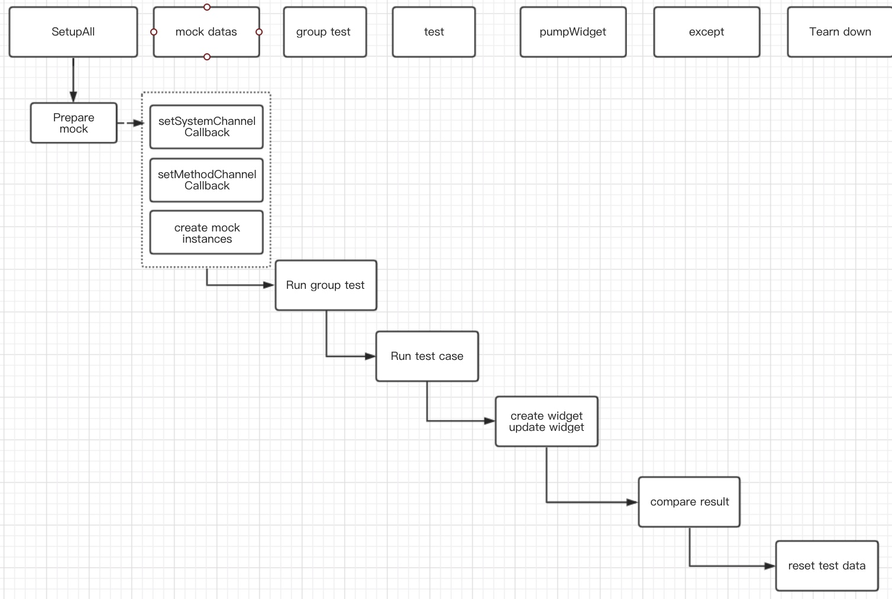

## Flutter测试
### Contents
### [1.单元测试](单元测试)
### [2.Widget测试](Widget测试)
### [3.集成测试](集成测试)
## 三种测试的优缺点

||单元测试| widget测试|  集成测试|
| --- | --- | ---| ---| 
|Confidence | Low |Higher |Highest
|维护成本|  Low| Higher | Highest
|依赖 |Few | More  |  Lots
|执行速度|  Quick | Slower | Slowest
## 单元测试
- [unit test 官方](https://flutter.dev/docs/cookbook/testing/unit/introduction)
- 1. add test or flutter_test depenency

## 生成测试报告
使用 test_coverage 
- brew install lcov
- flutter test --coverage
- genhtml coverage/lcov.info -o coverage/html

## 参考文档
- [Flutter Test官方](https://flutterchina.club/testing/)

# Flutter test

1. Basic

1. Concepts 

- Unit test

- example
- Practice

- widget test

- example

https://flutter.dev/docs/cookbook/testing/widget/introduction

- Practice

- intergation test

- example

https://flutter.dev/docs/cookbook/testing/integration/introduction

http://cogitas.net/write-integration-test-flutter/

- Practice

Assignment:

​    write unit test and widget test and integration test for counter demo    
​    3. Bloc test
​    
​    https://bloclibrary.dev/#/testing
​    4. Introduce Mockito library
​    
​    https://pub.dev/packages/mockito
​    
​    5. Library test
​    https://github.com/brianegan/flutter_architecture_samples/tree/master/todos_repository_simple
​    
​    4. TDD example
​    
​    https://resocoder.com/category/tutorials/flutter/tdd-clean-architecture/

## Flutter Plugin Test
1. 构造mock channel,`SetMockMethodChannel()`
2. 设置mock channel的回调方法
3. 如果涉及到视图的交互,需要设置`System.platformViews.mockMethodChannelCallback`来监听视图创建成功后的方法,在视图创建成功后再根据对应的id设置mockMethodChannel的回调信息。
4. 插件测试主要流程如下: 
    4.1 全局设置初始的mock数据,以每个文件的main函数为单位。对插件视图的构建和MethodChannel做统一的处理
    4.2 群组测试,将多个测试case一起组合测试,其实就是对main函数下面的全局mock数据再次做下一层级的统一划分,方便做归类测试.
    4.3 测试具体的单元,此节点为最小的测试单元,精确到代码执行的具体某个`case`,或`if/else`,或`三目运算`。
    4.4 对测试结果进行匹配,类型匹配,数量匹配,属性匹配,部分测试还需要指定超时匹配。
    4.5 测试完成后对测试结果进行统一销毁,以group为单位。
    4.6 如下为插件测试的基本步骤:

   4.7 参考文档: 具体可以参照Google-Maps的单元测试。
    - goole_maps_flutter: [https://pub.flutter-io.cn/packages/google_maps_flutter](https://pub.flutter-io.cn/packages/google_maps_flutter)

 